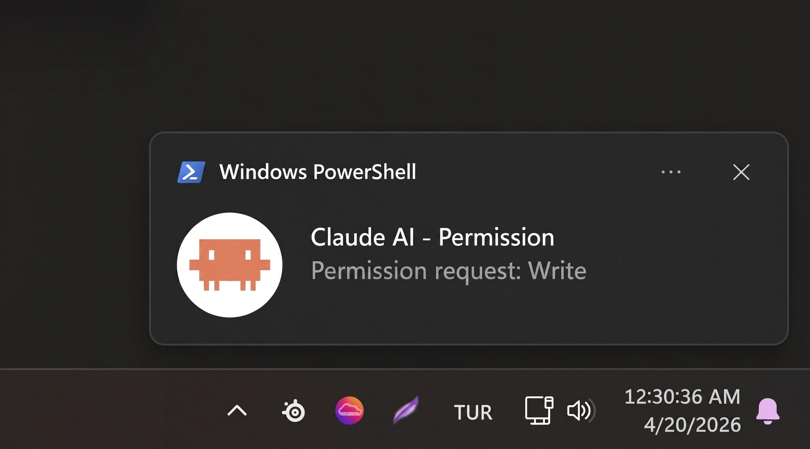

# notify

<p align="center">
  
</p>

Claude Code plugin for Windows — fires toast notifications and audio on permission requests and task completion.

## Events

| Hook | When | Behavior |
|------|------|----------|
| `PreToolUse` | Tool called | Starts 3s delayed notification |
| `PostToolUse` | Tool completes (auto-approved) | Cancels pending notification |
| `Stop` | Task completed | Toast: "Task completed." |

## How Permission Detection Works

`notify-permission.ps1` fires on every `PreToolUse`:

1. Writes a marker file to `%TEMP%\claude-perm-<tool>.pending`
2. Starts a background process that waits 3 seconds, then checks if the marker still exists
3. `notify-post.ps1` fires on `PostToolUse` — removes the marker immediately

If the tool is auto-approved, `PostToolUse` removes the marker before the 3s window expires → no notification. If the tool needs user permission, the user sees the prompt while the 3s passes → toast fires.

> **Note:** The terminal Claude Code CLI exposes a native permission prompt event, making direct detection straightforward. The VS Code chat extension does not — so this plugin uses the `PreToolUse` / `PostToolUse` marker-file approach as a workaround to detect when a permission prompt is actually shown.

## Requirements

- Windows (uses WPF + Windows toast APIs)
- [BurntToast](https://github.com/Windos/BurntToast) PowerShell module
- Windows notifications enabled, Do Not Disturb off

```powershell
Install-Module BurntToast -Scope CurrentUser
```

> **Note:** Toasts won't appear if notifications are blocked or Do Not Disturb is active.
> Enable via **Settings → System → Notifications** — turn on notifications for PowerShell,
> and disable Do Not Disturb (Focus assist).

## Installation

### 1. Install BurntToast

Open PowerShell as current user and run:

```powershell
Install-Module BurntToast -Scope CurrentUser
```

### 2. Enable Windows Notifications

- **Settings → System → Notifications** — turn on for PowerShell
- Disable **Do Not Disturb / Focus Assist**

### 3. Install the Plugin

`notify` is not in the official Claude Code marketplace. First add the marketplace, then install.

**Step 1 — Add marketplace:**

```powershell
claude plugin marketplace add enescaakir/notify
```

**Step 2 — Install plugin:**

```powershell
claude plugin install notify
```

> If you have multiple marketplaces configured and name conflicts, use `notify@enescaakir-plugins` to target this marketplace specifically.

**Option B — Manual:**

1. Clone or download this repo
2. Copy the folder to your plugins directory (e.g. `%APPDATA%\Claude\plugins\notify\`)
3. Run:

```powershell
claude plugin install --path "%APPDATA%\Claude\plugins\notify"
```

### 4. Verify

Run any Claude Code command that requires permission. You should hear a sound and see a Windows toast within 3 seconds of the permission prompt appearing.

## Customization

Edit `hooks/hooks.json` to change `-Title`, `-Message`, or `-Sound` for each event. Sound must be a path to a `.wav` file.

## License

MIT - i'm freeeeEEeee